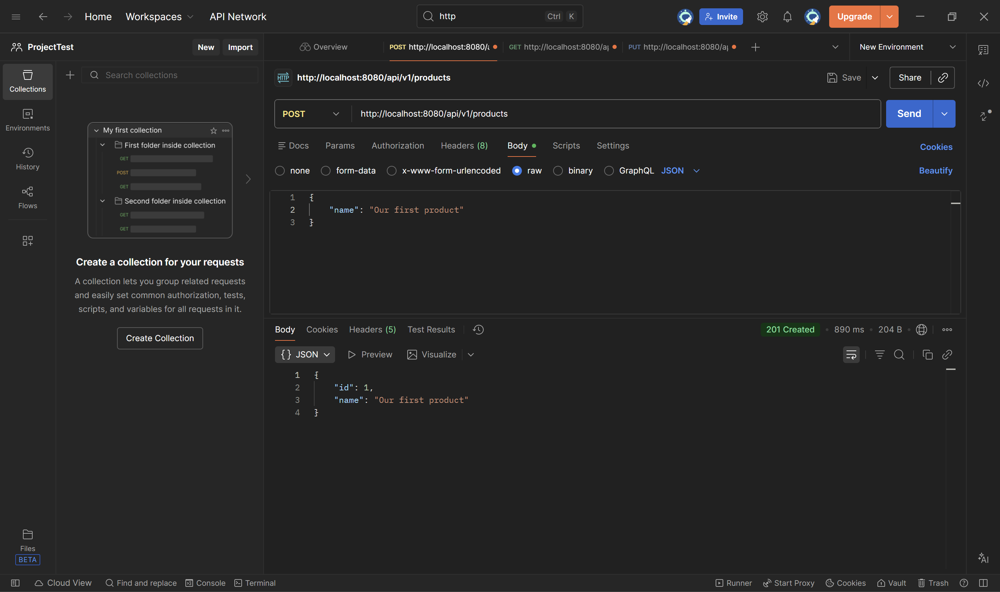
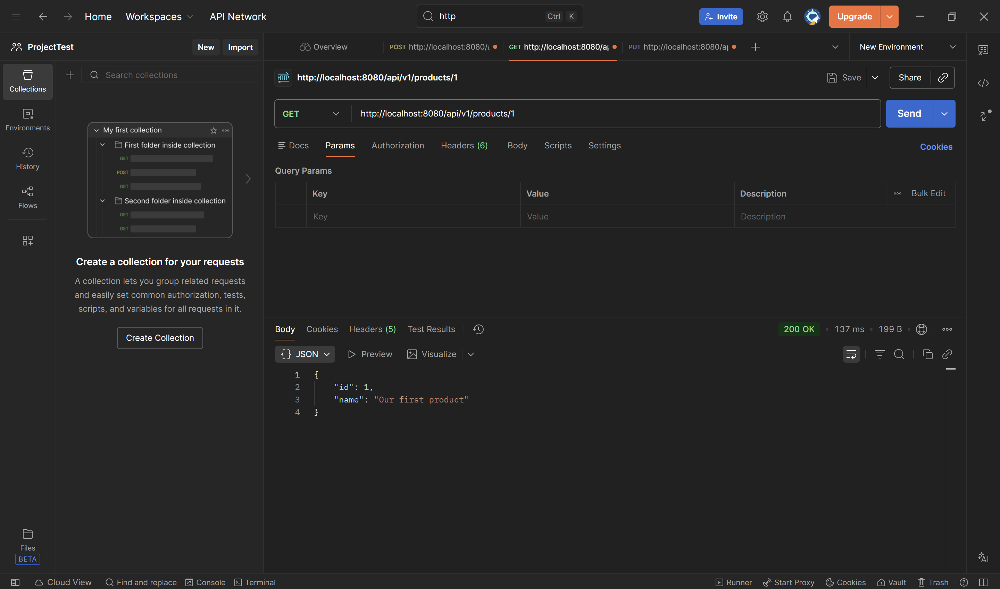
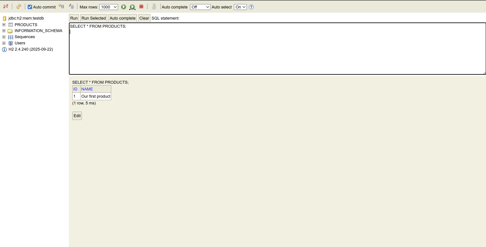
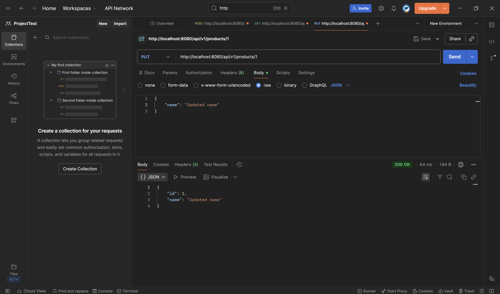
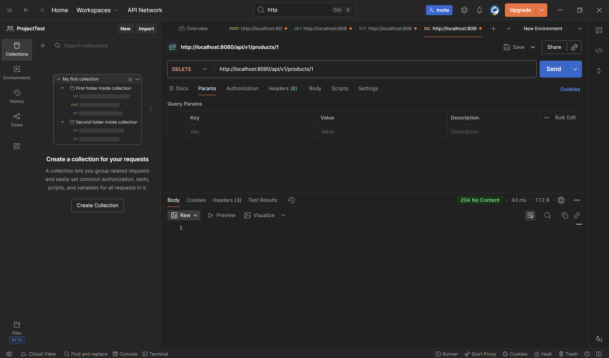
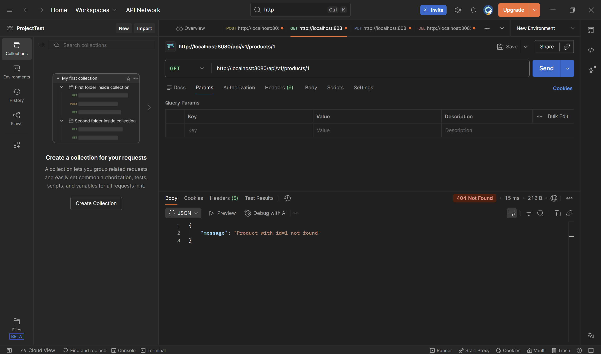

# PROJECT OVERVIEW

This project is a Spring Boot REST API application that demonstrates a layered architecture commonly used in Java backend systems. The application manages a simple Product resource and exposes HTTP endpoints that allow clients to create, read, update, delete, and list products.

The main goal of the project is to show how different application layers cooperate with each other, how HTTP requests are handled, how business logic is separated from data access, and how objects are transformed between layers.

## APPLICATION ARCHITECTURE OVERVIEW

The project is divided into the following logical layers:

- API layer (Controller)

- Request and Response layer (DTOs)

- Domain layer (Entity)

- Service layer (Business logic)

- Repository layer (Data access)

- Support layer (Mappers and Exception handling)

Each layer has a clear responsibility and communicates only with the layers directly above or below it.

### API LAYER (CONTROLLER)

The API layer is responsible for handling HTTP requests and returning HTTP responses. It acts as the entry point to the application.

What it does:

Receives HTTP requests (GET, POST, PUT, DELETE)

Converts request data into Java objects

Calls the service layer to perform business operations

Returns HTTP responses with proper status codes

Main class:
ProductController

Examples:

- POST /api/v1/products

Creates a new product based on JSON data sent by the client.

- GET /api/v1/products/{id}

Returns a single product by its ID.

- GET /api/v1/products

Returns a list of all products.

- PUT /api/v1/products/{id}

Updates an existing product.

- DELETE /api/v1/products/{id}

Deletes a product by ID.

The controller doesn't contain business logic. It only coordinates the request and response flow.

### REQUEST AND RESPONSE LAYER (DTOs)

This layer is used to transfer data between the client and the server in a controlled way.

What it does:

1 - Defines the structure of incoming and outgoing HTTP requests

2 - Protects the domain model from direct exposure

Main classes:

- ProductRequest
- UpdateProductRequest
- ProductResponse
- ErrorMessageResponse

Examples:

- ProductRequest

Used when creating a product. Contains fields such as "name".

- UpdateProductRequest

Used when updating an existing product.

- ProductResponse

Returned to the client after successful operations, contains fields like id and name.

- ErrorMessageResponse

Returned when an error occurs (for example, product not found).

These classes do not contain logic. They are simple data containers.

### DOMAIN LAYER (ENTITY)

The domain layer represents the core business object of the application.

What it does:

1 - Defines the Product entity

2 - Maps Java objects to database tables using JPA

3 - Represents real world concepts in code

Main class:
Product

Examples:

- Product has fields like id and name

- Annotated with @Entity to indicate a database table

- Uses @Id and @GeneratedValue for primary key handling

- The Product class represents how data is stored internally and in the database.

### SERVICE LAYER (BUSINESS LOGIC)

The service layer contains the business logic of the application.

What it does:

1 - Processes data before saving or returning it

2 - Coordinates between controller, repository, and mapper

3 - Applies validation and rules

4 - Handles application specific logic

Main class:
ProductService

Examples:

- create(ProductRequest request) :
Creates a new product and saves it in the database.

- find(Long id) :
Retrieves a product by ID or throws an exception if not found.

- update(Long id, UpdateProductRequest request) :
Updates an existing product.

- findAll() :
Returns all products.

- delete(Long id) :
Deletes a product if it exists.

The service layer doesn't deal with HTTP details and does not access the database directly.

### REPOSITORY LAYER (DATA ACCESS)

The repository layer is responsible for communication with the database.

What it does:

1 - Saves data to the database

2 - Retrieves data from the database

3 - Deletes data from the database

Main class:
ProductRepository

Examples:

- save(Product product)

- findById(Long id)

- findAll()

- deleteById(Long id)

When using Spring Data JPA, these methods are provided automatically by extending JpaRepository. No implementation code is required.

### SUPPORT LAYER (MAPPERS AND EXCEPTIONS)

The support layer contains helper classes that support the main application flow.

What it does:

1 - Maps objects between different layers

2- Centralizes exception handling

3 - Improves code readability and reuse

Main classes:

- ProductMapper

- ProductNotFoundException

- ProductExceptionSupplier

- GlobalExceptionHandler (ControllerAdvice)

This layer keeps the service and controller layers clean and focused.

### DATABASE AND TOOLS

Database : H2

ORM: Hibernate and Spring Data JPA

API documentation: Swagger UI

Testing tools: Postman, Swagger

The H2 database stores data only while the application is running and is used for development and testing purposes.

### PRINTS

Below I'm going to demonstrate using PUT, POST, GET, and DELETE requests using Postman and checking the results on the database : 

Output of the method POST :

 
 

Output of the method GET :

 
 

Database after the method GET :

 
 

Output of the method PUT :

 
 

Database after the method PUT :

 
 

Output of the method DELETE :

 
 

Database after the deleting a resource :

 
 

Trying to use the method GET after deleting a resource will cause this result :

